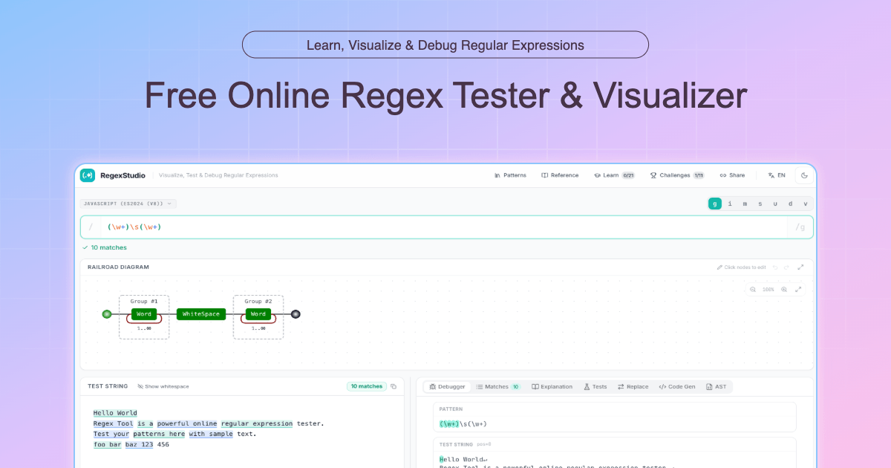

<div align="center">

# RegexStudio

**现代化、可视化、可调试的正则表达式工作台**

[](https://www.gnu.org/licenses/agpl-3.0)
[](https://react.dev)
[](https://tanstack.com/start)
[](https://www.typescriptlang.org)
[](https://vitejs.dev)
[](#贡献)

[English](./README.md) · **简体中文**

[功能特性](#功能特性) · [快速开始](#快速开始) · [开发](#开发) · [贡献](#贡献) · [协议](#开源协议)

</div>

---

## 简介

**RegexStudio** 是一款开源的正则表达式在线工作台,目标是用现代化的 UI 和可视化能力,让正则表达式的编写、理解、调试和分享变得轻松自然。

与传统的正则工具相比,RegexStudio 在保留实时匹配、捕获组检视等基础能力的同时,提供了**铁路图 (Railroad Diagram)**、**节点编辑器**、**逐段解释**等多种可视化视图,帮助使用者从不同维度理解一段正则表达式。

> 📝 项目目前处于活跃开发阶段。



---

## 功能特性

### 编辑与可视化

- 🎨 **语法高亮编辑器** —— 基于 CodeMirror 6，实时着色与错误提示，支持 flags 切换
- 🔍 **实时匹配测试** —— 多行测试文本，匹配结果即时高亮，捕获组详情一目了然
- 🚂 **铁路图可视化** —— 将正则结构渲染为直观的铁路图，复杂结构一眼看懂
- 🧩 **可视化节点编辑器** —— 通过拖拽节点构建/修改正则，降低初学者门槛
- 📖 **逐段解释面板** —— 自动将正则翻译为人类可读的解释
- 🔁 **替换预览** —— 实时预览替换结果，直观对比替换前后差异

### 调试与测试

- 🐞 **逐步调试器** —— 像调试代码一样单步执行正则匹配，可视化回溯过程与捕获组快照
- ✅ **测试用例面板** —— 维护多组测试字符串，标记期望匹配/不匹配，一键批量运行
- ⚠️ **兼容性提示** —— 静态检查并提示当前正则在目标引擎中可能不被支持的语法

### 多引擎与代码生成

- 🌐 **引擎风味切换** —— 可在 JavaScript、PCRE、Python、Java、Go、.NET、Rust、Ruby 等之间切换
- 🛠️ **代码生成器** —— 一键生成 **10 种语言** 的可运行代码：JavaScript / TypeScript、Python、Java、Go、Rust、C# (.NET)、PHP、Ruby、Swift、Kotlin

### 学习与练习

- 🎓 **交互式教程** —— 覆盖基础、量词、分组、前后顾、实战模式的分级课程，支持实时校验
- 🏆 **挑战模式** —— 内置一系列小练习，自动判分，帮助巩固技巧
- 📚 **常用模式库** —— 邮箱、URL、IP、日期等开箱即用的常用模式
- 📋 **快速参考手册** —— 内置语法速查表，告别频繁切换文档

### 分享与体验

- 🔗 **分享链接** —— 将正则、flags、测试文本与替换内容编码进 URL，一键分享完整上下文
- � **中英双语 i18n** —— 基于 Paraglide 实现，路由级别区分语言
- � **暗色 / 亮色主题** —— 跟随系统或手动切换
- ⚡ **SSR 友好** —— 基于 TanStack Start，首屏即可渲染，SEO & 分享更友好

---

## 技术栈

| 类别 | 技术 |
|---|---|
| **框架** | [React 18](https://react.dev) + [TanStack Start](https://tanstack.com/start) + [TanStack Router](https://tanstack.com/router) |
| **构建** | [Vite 7](https://vitejs.dev) |
| **语言** | [TypeScript 5](https://www.typescriptlang.org) |
| **样式** | [Tailwind CSS](https://tailwindcss.com) + [shadcn/ui](https://ui.shadcn.com) + [Radix UI](https://www.radix-ui.com) |
| **编辑器** | [CodeMirror 6](https://codemirror.net) |
| **状态管理** | [Zustand](https://zustand-demo.pmnd.rs) |
| **图标** | [Lucide](https://lucide.dev) |
| **国际化** | [Inlang Paraglide JS](https://inlang.com/m/gerre34r/library-inlang-paraglideJs) |
| **代码规范** | [Biome](https://biomejs.dev)（lint + format） |

---

## 快速开始

### 环境要求

- **Node.js** ≥ 20
- **pnpm** ≥ 9 (推荐) 或 npm / yarn

### 安装与运行

```bash
# 1. 克隆仓库
git clone https://github.com/chenz24/regex-studio.git
cd regex-studio

# 2. 安装依赖
pnpm install

# 3. 启动开发服务器
pnpm dev
```

开发服务器启动后,默认访问 [http://localhost:3000](http://localhost:3000)。

### 构建生产版本

```bash
pnpm build      # 构建生产产物
pnpm preview    # 本地预览生产产物
```

---

## 开发

### 常用脚本

| 命令 | 说明 |
|---|---|
| `pnpm dev` | 启动开发服务器(支持 HMR + SSR) |
| `pnpm build` | 构建生产产物 |
| `pnpm build:dev` | 以 development 模式构建(便于调试) |
| `pnpm preview` | 预览生产产物 |
| `pnpm lint` | 运行 Biome lint |
| `pnpm format` | 使用 Biome 格式化代码 |
| `pnpm check:biome` | 运行 Biome check 并自动修复 |
| `pnpm typecheck` | 运行 TypeScript 类型检查 |
| `pnpm check` | 同时执行 typecheck 与 lint |

### 项目结构

```
regex-studio/
├── messages/                  # Paraglide i18n 文案源文件（en.json、zh.json）
├── project.inlang/            # Inlang 项目配置
├── public/                    # 静态资源（favicon、sitemap 等）
├── src/
│   ├── challenges/            # 挑战题数据与判分逻辑
│   ├── components/
│   │   ├── challenges/        # 挑战相关 UI（目录、运行器、抽屉）
│   │   ├── diagram/           # 铁路图与节点编辑器
│   │   ├── editor/            # 正则输入、引擎选择、兼容性提示
│   │   ├── layout/            # 测试区、工具面板、Footer
│   │   ├── sidebar/           # 常用模式库与快速参考
│   │   ├── tools/             # 调试器、代码生成、解释、替换、测试用例面板
│   │   ├── tutorial/          # 教程 UI（目录、运行器、提示等）
│   │   └── ui/                # shadcn/ui 原语
│   ├── hooks/                 # 自定义 hooks
│   ├── lib/                   # AST、i18n、分享链接等工具
│   ├── paraglide/             # Paraglide 编译产物（自动生成）
│   ├── routes/                # TanStack Router 文件路由
│   │   ├── __root.tsx         # 根路由（含 SSR shell）
│   │   ├── index.tsx          # 默认语言入口
│   │   └── $locale/           # 语言感知路由（en、zh）
│   ├── stores/                # Zustand 状态（regex、tutorial、challenges）
│   ├── tutorial/              # 课程、校验器、注册表
│   ├── utils/                 # 解析器、匹配器、铁路图 IR、代码生成等
│   │   └── codegen/           # 10 种目标语言的代码生成器
│   ├── ssr.tsx                # SSR 入口
│   ├── router.tsx             # Router 实例
│   └── index.css              # 全局样式
├── biome.json                 # Biome 配置
├── vite.config.ts
└── package.json
```

---

## 贡献

非常欢迎任何形式的贡献!不论是 Bug 反馈、功能建议、文档完善还是代码提交,都将被认真对待。

### 参与方式

1. **提 Issue**
   - 🐛 报告 Bug:请提供复现步骤、期望行为、实际行为、运行环境
   - 💡 建议功能:描述使用场景与价值
2. **提 Pull Request**
   1. Fork 本仓库并基于 `main` 创建特性分支
   2. 提交前请运行 `pnpm check` 确保通过 lint 与类型检查
   3. 保持提交信息清晰,推荐使用 [Conventional Commits](https://www.conventionalcommits.org/) 规范
   4. PR 描述中说明动机、改动范围与测试方式
3. **传播与反馈**
   - 在你的项目、文章、社交平台分享 RegexStudio
   - 给项目点一个 ⭐ 是对作者最直接的鼓励

### 开发约定

- 代码风格由 **Biome** 统一负责（lint + format）
- 组件使用 **函数式 + Hooks**，避免 class component
- 样式优先使用 **Tailwind 工具类**，复杂场景再抽 CSS
- 业务状态用 Zustand 管理，UI 局部状态用 `useState`/`useReducer`
- 新增界面文案时，请同时维护 `messages/en.json` 与 `messages/zh.json`，并通过 Paraglide 调用

---

## 开源协议

本项目基于 **GNU Affero General Public License v3.0 (AGPL-3.0)** 协议开源。

- ✅ 你可以**自由使用、修改、分发**本项目源代码
- ⚠️ 一旦你**修改**本项目并通过网络对外提供服务,你**必须**以相同的 AGPL-3.0 协议公开你的全部修改源代码
- ⚠️ 衍生作品必须保留原始版权声明与协议

完整协议文本见 [GNU AGPL-3.0 官方页面](https://www.gnu.org/licenses/agpl-3.0.html)。

> 💼 **商业使用提示**:如果 AGPL-3.0 的网络服务条款不适合贵公司的使用场景,欢迎联系作者讨论商业授权。

---

## 其它项目

作者维护的其他小而美的开发者工具,欢迎顺手体验:

- [**rename.tools**](https://rename.tools) —— 浏览器内批量重命名文件,支持实时预览与正则规则
- [**crontab.cv**](https://crontab.cv) —— 可视化构建与解释 crontab 表达式,一眼看懂执行计划
- [**json.tools**](https://json.tools) —— 在同一个标签页里完成 JSON 格式化、校验、比对与查询
- [**easing.tools**](https://easing.tools) —— 交互式设计与预览 CSS / 动画缓动曲线
- [**open-awesome.com**](https://open-awesome.com) —— 浏览与发现开源社区精选的 awesome-* 清单

---

## 致谢

RegexStudio 的诞生离不开开源社区的众多优秀项目,在此特别感谢:

- [TanStack](https://tanstack.com) —— Router / Start 提供的现代化全栈方案
- [CodeMirror](https://codemirror.net) —— 强大的代码编辑器内核
- [shadcn/ui](https://ui.shadcn.com) & [Radix UI](https://www.radix-ui.com) —— 优雅的 UI 原语
- [Tailwind CSS](https://tailwindcss.com) —— 让样式开发变得愉快

---

<div align="center">

如果 RegexStudio 对你有帮助,欢迎 ⭐ Star 支持!

</div>
